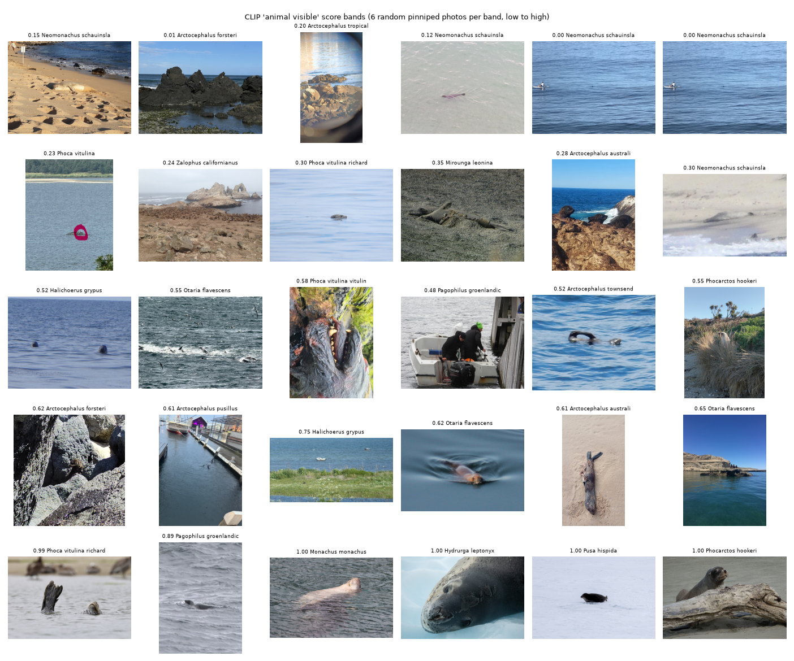
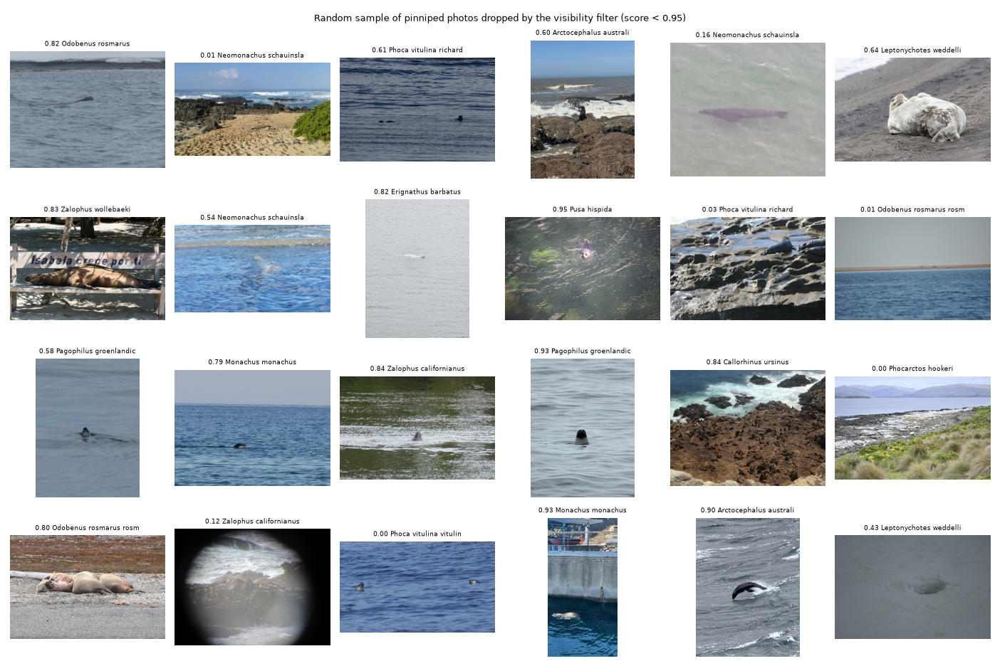
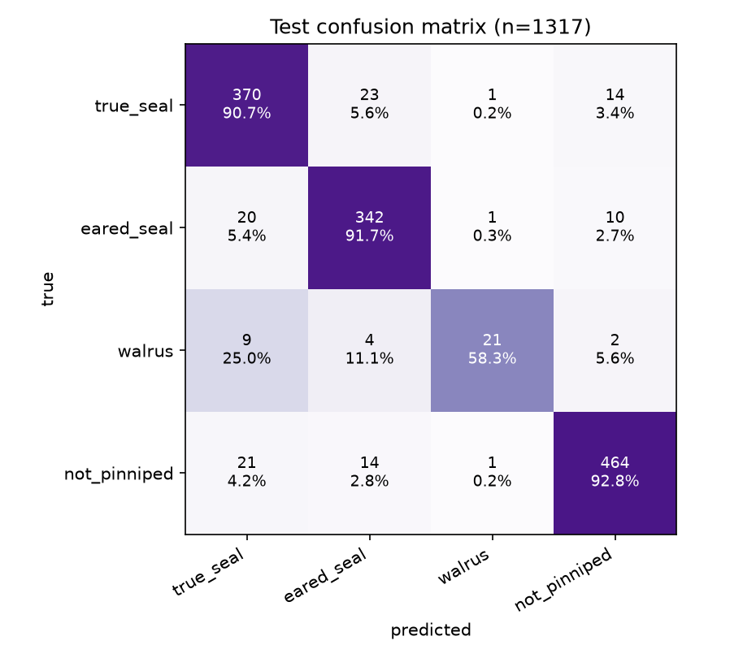
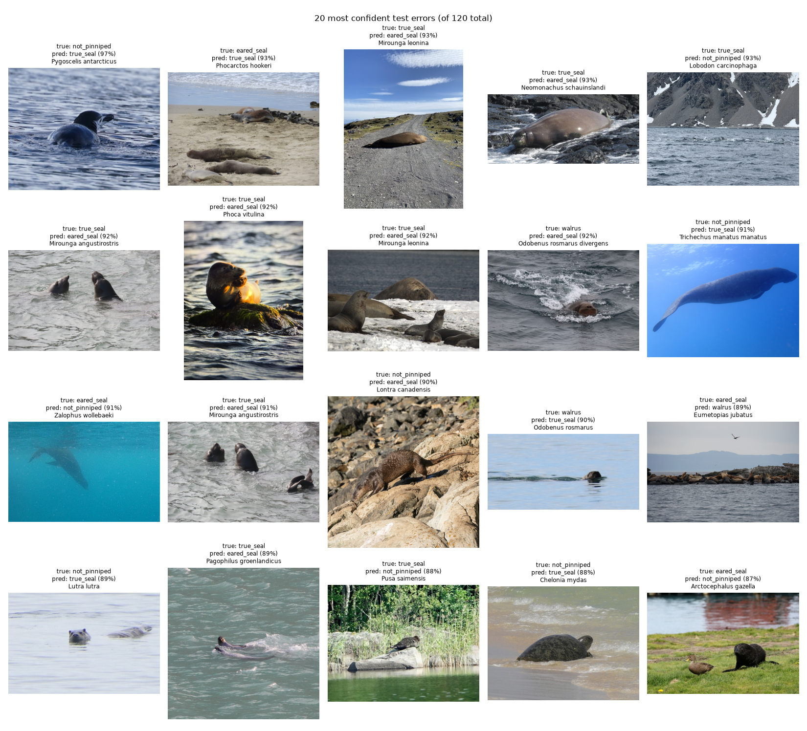

# Seal or Sea Lion?

A tiny image classifier that looks at a photo and tells you whether it's a **true seal**, an
**eared seal** (sea lion *or* fur seal), or a **walrus**, and roasts you gently when it's none of
those. It runs entirely in the browser: the photo never leaves your device.

**Live page:** <https://quinnlambert.com/seal> · **Training code:** this repo

**Result:** 89.7 % pinniped test accuracy (fur seals 92.5 %), 93.5 % on the photos it is
confident about, from a 5 MB ONNX model. The 95 % target was not reached; see
[Results](#results) and [Limitations](#known-limitations-and-failure-examples).

## Why three families instead of "seal vs sea lion"

Pinnipeds split into three families:

| Family | Common name | Members | The visual tell |
|---|---|---|---|
| Phocidae | true (earless) seals | harbor, grey, elephant, leopard, monk seals… | no ear flaps, short clawed front flippers, wriggles on its belly |
| Otariidae | eared seals | **sea lions and fur seals** | visible ear flaps, long front flippers, can "walk" on rotated hind flippers |
| Odobenidae | walrus | just the walrus | tusks, whiskers, sheer size |

"Seal vs sea lion" is the popular framing, but it's taxonomically wrong: **fur seals are
otariids**, i.e. they are on team sea lion, not team seal. Classifying at the family level
means the answer is always correct, and the question mark in the name lets the result
correct the premise ("your 'seal' is actually on team sea lion").

## Data: iNaturalist, CC0 / CC-BY only

All images come from [iNaturalist](https://www.inaturalist.org) via its public API
(`scripts/download.py`). Filters:

* **research-grade** observations only (community-verified IDs),
* photos licensed **CC0 or CC-BY** only (each photo's license is checked individually, not
  just the observation's),
* taxon IDs are looked up **by name at run time**, never hardcoded.

Every image's observation ID, species, license, photographer attribution and URL is recorded
in [`data/manifest.csv`](data/manifest.csv). The raw images are not committed;
`python scripts/download.py --from-manifest` re-downloads exactly this dataset.

### Sampling policy

iNaturalist is very skewed (harbor seals and California sea lions are most of the pinniped
observations). To get species and geographic variety, the observation budget for each class is
**water-filled across species**: rare species contribute everything they have, common species
are capped at an equal share of what's left. Otariidae gets two separate budgets, one for fur
seals and one for sea lions, because fur seals are the case this whole app exists for.

Observations the iNaturalist community has annotated as *dead*, *track*, *scat*, *bone*,
*feather* or *egg* are skipped at download time, and "medium" files under 200 px (thumbnails
of deleted originals) are dropped.

| Class | Photos (train / val / test) | Species |
|---|---|---|
| `true_seal` (Phocidae) | 2 706 (1 886 / 412 / 408) | 19 |
| `eared_seal` (Otariidae) | 2 532 (1 769 / 390 / 373); 1 161 fur seal, 1 371 sea lion | 15 (9 fur seal, 6 sea lion) |
| `walrus` (Odobenidae) | 239 (167 / 36 / 36) | 1 (every licensed research-grade walrus observation there is) |
| `not_pinniped` | 3 326 (2 326 / 500 / 500) | 19 negative taxa |
| **total** | **8 803** from 7 367 observations, split 5 153 / 1 107 / 1 107 by observation | 1 900+ photographers; ~80 % CC-BY, ~20 % CC0 |

The `not_pinniped` class is deliberately weighted toward **lookalikes**: otters, manatees and
dugongs, dolphins and whales, penguins, bears, hippos, sea turtles, beavers, crocodilians. Then
a smaller share of other common animals (dogs, cats, deer, bovids, gulls, cormorants) and a
small slice of plants, fungi and insects so a photo of your lunch also gets roasted. No people.

### The visibility filter (why there is a `scripts/filter.py`)

The first version of this dataset, sampled without any filtering, capped the model at ~80 %
and even a frozen DINOv2 ViT-S linear probe only reached 83 %. Looking at the images explained
it: a research-grade iNaturalist observation records *presence*, not a portrait. A large share
of pinniped photos are a speck in the water, an aerial view of a colony, empty ocean where the
animal just dived, a skull, or a carcass (iNat's own annotations mark 8 % of eared-seal
observations as dead, and only a quarter of observations are annotated at all).

`scripts/filter.py` scores every photo with CLIP ViT-B/32 zero-shot: softmax mass on "a seal /
sea lion / walrus / an animal clearly visible" prompts vs "empty ocean / aerial beach / skull /
carcass / tracks / blurry" prompts. The score is strongly bimodal; pinniped photos below 0.95
(15 %) are dropped from training **and** evaluation. `not_pinniped` photos are kept as they
are, because an empty beach *is* not a pinniped. The threshold was chosen by eye from the band
grids, and every score is kept in `data/manifest_unfiltered.csv` so the decision is auditable.




The filter is not perfect: a few clearly visible animals (a Weddell seal pair, a sea lion on a
bench) score low and are lost, and plenty of "lone head in the water" photos score high and
stay. Those remaining photos are where most of the model's errors are (see Results).

### Splitting by observation, not by photo

An iNaturalist observation often carries several photos of the same animal taken seconds
apart. If those were split independently, the test set would contain near-duplicates of
training images and the accuracy would be inflated. `scripts/split.py` therefore assigns
**whole observations** to train/val/test (70/15/15, stratified by class and subgroup, fixed
seed) and asserts that no observation spans two splits.

## Model

`mobilenetv3_large_100` from `timm`, initialised from the `miil_in21k_ft_in1k` weights
(ImageNet-21k pretraining, then ImageNet-1k), fine-tuned end to end at **288×288**.

Why this one and not `efficientnet_b0`:

* **Size.** Once the 1000-way ImageNet head is swapped for a 4-way head it has 4.2M
  parameters → 16.8 MB as fp32 ONNX. Under the 20 MB budget without quantization.
* **Speed in WASM.** ~0.22 GFLOPs per image at 224 px (~0.36 at 288) vs ~0.39 / ~0.65 for
  EfficientNet-B0; roughly 1.8× cheaper on a phone running `onnxruntime-web` without a GPU.
* **Exports cleanly.** Hardswish / hardsigmoid / squeeze-excite all map to plain ONNX opset-17
  ops that ORT-web's WASM backend supports.
* **Better starting features.** ImageNet-21k has far more animal categories than ImageNet-1k.
  On the same frozen-feature linear probe the IN-21k MobileNetV3 features scored 78 % vs 76 %
  for `efficientnet_b0.ra_in1k`, so the smaller model also starts from the better features.

Two things that were not obvious and cost real accuracy before they were fixed:

* The `miil_in21k_ft_in1k` weights expect **raw [0,1] inputs (mean 0, std 1)**, not ImageNet
  mean/std. Mean/std are now read from timm's pretrained config, stored in the checkpoint and
  written to `model_meta.json`; nothing hardcodes them.
* timm initialises a fresh 4-way `Linear` head with `uniform(±1/√fan_out)` = ±0.5, so the
  untrained model emitted logits of ±20 and blasted the pretrained backbone with huge gradients
  in epoch 1. The head now starts near zero.

Training recipe (`scripts/train.py`): AdamW, cosine schedule with one warmup epoch, lower LR
on the backbone than the head, label smoothing 0.1, mixed precision on GPU, **square-root
class-balanced sampling** (walrus has 10× fewer photos than the other classes and its recall
collapsed without it). Augmentation is random-resized-crop (scale 0.35–1), horizontal flip,
colour jitter and light random erasing, because water, sand, rock and ice backgrounds vary
enormously across iNat photos. Model selection is by validation **pinniped** accuracy, since
that's the ship bar. 288 px instead of 224 px was worth +2.2 points of pinniped test accuracy
(86.3 % → 88.5 %): the residual errors are small, distant animals, so pixels matter.

**Inference runs at 352 px, above the 288 px training size, on purpose.** Random-resized-crop
training shows the network objects larger than a centre crop does at test time (the "FixRes"
effect), so testing somewhat above the training resolution helps: 352 px gave +1.2 points
(88.5 % → 89.7 %) for 1.5× the compute and no retraining; 384 and 416 were already past the
sweet spot. The threshold was re-tuned at 352.

Preprocessing at inference (also written into `export/model_meta.json` for the browser):
resize the shorter side to 402 (bilinear) → centre-crop 352 → scale to [0,1] → normalise
with the checkpoint's mean/std (0 / 1 for these weights) → NCHW, RGB.

## Results

**The ship bar was ≥ 95 % test accuracy on the three pinniped classes. The result is 89.7 %.
The bar was not met**, and the numbers below are reported as they are. The [Limitations](#known-limitations-and-failure-examples)
section explains where the remaining errors come from and what would move the number.

Test set: 1 317 photos from 1 107 observations never seen in training. Best epoch 11 of 12
(validation pinniped accuracy 90.3 % at the 288 px training size), evaluated at 352 px.

| Metric (test) | Value |
|---|---|
| Pinniped accuracy, strict (4-way argmax on the 817 pinniped photos) | **89.7 %** |
| Pinniped accuracy, 3-way (argmax over the three pinniped classes only) | 91.4 % |
| Overall 4-way accuracy | 90.9 % |
| **Fur seal subgroup**: fur-seal photos called `eared_seal` (n = 173) | **92.5 %** |
| Sea lion subgroup: sea-lion photos called `eared_seal` (n = 200) | 91.0 % |
| `not_pinniped` precision / recall | 94.7 % / 92.8 % |
| `not_pinniped` recall on lookalikes / other animals / non-animals | 89.1 % / 99.2 % / 100 % |

Per class:

| Class | Precision | Recall | F1 | n |
|---|---|---|---|---|
| `true_seal` | 0.881 | 0.907 | 0.894 | 408 |
| `eared_seal` | 0.893 | 0.917 | 0.905 | 373 |
| `walrus` | 0.875 | 0.583 | 0.700 | 36 |
| `not_pinniped` | 0.947 | 0.928 | 0.937 | 500 |



Fur seals, the case the app exists for, are the *best* subgroup of Otariidae (92.5 %), so the
"your seal is on team sea lion" correction is on solid ground. Walrus is the weak class: with
only 36 test photos, 15 misses is 58 % recall, and most misses go to `true_seal` (a
tuskless walrus lying on a beach is a big brown blob). Walrus is also the one class that got
*worse* going from 288 to 352 px (64 % → 58 %, i.e. two photos), which is within the noise of
a 36-photo class.

### Accuracy depends on how visible the animal is

The CLIP visibility score from the filter step is a good proxy for "is this a photo a person
would actually upload". Pinniped test accuracy by score band:

| CLIP visibility score | n | Pinniped accuracy (288 px model) |
|---|---|---|
| 0.9999 – 1 (portrait-like, animal fills the frame) | 353 | **93.5 %** |
| 0.999 – 0.9999 | 232 | 91.8 % |
| 0.99 – 0.999 | 145 | 85.5 % |
| 0.95 – 0.99 (barely passed the filter) | 87 | 64.4 % |

Even on the clearest photos the model is around 93–94 %, not 95 %; the honest reading is that
a 4M-parameter model tops out a little below the bar on this data.

### The "unsure" threshold

Softmax confidence alone is a poor out-of-distribution detector, which is why `not_pinniped`
is a trained class. The threshold is a second line of defence: if the top class is a pinniped
but its probability is below **0.85**, the page shows an "unsure" response instead. The value
was chosen on the validation set to maximise (fraction of wrong pinniped answers flagged) −
(fraction of right pinniped answers flagged), i.e. Youden's J (`reports/threshold_sweep.csv`).
On the test set it:

* flags 26.2 % of pinniped photos as unsure (coverage 73.8 %),
* raises accuracy on the pinniped photos it does answer from 89.7 % to **93.5 %**
  (errors 84 → 39),
* cuts non-pinnipeds confidently called a pinniped from 36 to 8 (of 500).

Raising the threshold further does not help: above ~0.85 the confidently *wrong* answers
survive while moderately confident right ones get flagged, so accuracy-on-answered falls.
Flip test-time augmentation (+0.1) and ensembling the 224 and 288 px models (+0.1) were also
measured and are not worth their 2× cost.

### Export

| File | Size | Test accuracy (4-way) | Pinniped accuracy | Shipped? |
|---|---|---|---|---|
| `export/pinniped_w8.onnx` (int8 weights, fp32 compute, opset 17) | **5.0 MB** | 90.9 % | 89.7 % | **yes** |
| `export/pinniped.onnx` (fp32 reference) | 16.8 MB | 90.9 % | 89.7 % | kept as the reference |
| int8 static quantization (QDQ, weights + activations) | 4.7 MB | 74.5 % | 62.7 % | no (−25.8 points) |

Two kinds of int8 were tried and they are not the same thing:

* **Static int8** (weights *and* activations) destroyed the model. MobileNetV3's hardswish and
  squeeze-excite blocks produce activation outliers that MinMax calibration cannot handle,
  and the percentile / entropy calibrators that would fix that crash in onnxruntime 1.30 with
  numpy 2 (`ValueError: inhomogeneous shape` inside the histogram collector).
* **Weight-only int8** keeps all compute in fp32 and just stores the conv weights as int8
  with a per-channel `DequantizeLinear` in front of each one, so no calibration is needed and
  the runtime dequantizes once at load. Naively that cost 1.5 points; keeping every tensor
  under 20k elements in fp32 (first conv, squeeze-excite, early depthwise convs: 0.9 MB in
  total) and picking each channel's scale by a small MSE search instead of max-abs brought
  the drop to 0.0. That is the shipped file. It also means a backbone with ~4× the parameters
  could still ship under 20 MB.

`export/model_meta.json` carries the class order, input shape (1×3×352×352), preprocessing
steps, mean/std and threshold; the page must implement exactly that spec.
`scripts/parity.py` confirms PyTorch and ONNX Runtime agree on the 12 committed sample images
in `reports/parity_samples/` (max |Δ probability| ~10⁻⁶ for fp32, identical argmax; the int8-
weight file's outputs are recorded separately); `reports/parity.json` stores their per-image
probabilities so the browser build can be checked against the same images.

## Known limitations and failure examples



* **A lone head in the water is the dominant error.** Ear flaps and flippers are the family
  tells, and they are underwater. True seal ↔ eared seal confusions (50 of 94 pinniped errors)
  are mostly this. Some of these are genuinely undecidable at 288 px.
* **Swimming lookalikes leak in.** An otter, penguin or manatee head at the surface is called a
  seal; lookalike recall is 87.9 % vs 99–100 % for other animals and non-animals. The threshold
  catches most of the confident ones (40 → 9).
* **Walrus is under-represented.** 239 photos total, 36 in test. Class-balanced sampling took
  recall from 58 % to 64 %; more data is the real fix, and iNaturalist doesn't have it under
  CC0/CC-BY.
* **Distant animals.** Accuracy falls off sharply with the visibility score (table above).
  The site's "unsure" response is the mitigation; a user's own phone photo is usually the
  portrait-like case.
* **Bias from the data source.** The training photos are what naturalists upload: wild animals,
  daylight, mostly haul-outs and coastlines. Aquarium shots, night photos and plush toys were
  not seen in training.

What would move the number, roughly in order of expected gain per hour: a bigger backbone
shipped as int8 once the calibrator bug is fixed (a frozen DINOv2 ViT-S probe already beats
this model's frozen features by 5 points), distillation from such a teacher into MobileNetV3,
and test-time horizontal-flip averaging in the browser (2× inference cost).

## Reproduce

Locally (CPU is fine for everything except training, which takes ~70 min for 12 epochs at
288 px on an 8-core laptop; use the Colab notebook for a GPU). `train.py`'s defaults are the
shipped configuration (`--img-size 288 --balance 0.5`):

```bash
python -m venv .venv && source .venv/bin/activate
pip install --index-url https://download.pytorch.org/whl/cpu torch==2.14.0 torchvision==0.29.0
pip install -r requirements.txt

python scripts/download.py --from-manifest   # ~8k photos, ~800 MB; exact committed dataset
# python scripts/download.py && python scripts/filter.py && python scripts/split.py   # ...or draw a fresh sample
python scripts/train.py                      # -> outputs/best.pt
python scripts/eval.py --img-size 352        # -> reports/metrics.json + figures, tunes threshold on val (at the inference size)
python scripts/export.py                     # -> export/pinniped.onnx, pinniped_w8.onnx (int8 weights), model_meta.json
python scripts/parity.py                     # PyTorch vs ONNX Runtime on committed sample images
python scripts/predict.py some_photo.jpg     # try it
```

On Colab: open [`notebooks/train_colab.ipynb`](notebooks/train_colab.ipynb), pick a GPU
runtime, run all cells. It clones this repo, re-downloads the dataset from the manifest,
trains, evaluates, exports and zips the artefacts.

## Repo layout

```
scripts/common.py     class order, taxa config, preprocessing spec (single source of truth)
scripts/download.py   iNaturalist sampling + download -> data/manifest.csv
scripts/filter.py     CLIP zero-shot 'is an animal visible?' filter -> manifest_unfiltered.csv + manifest.csv
scripts/split.py      observation-grouped 70/15/15 split -> manifest `split` column
scripts/train.py      timm fine-tuning
scripts/eval.py       metrics, confusion matrix, worst errors, threshold tuning
scripts/export.py     ONNX + int8 + model_meta.json
scripts/parity.py     PyTorch vs onnxruntime check on reports/parity_samples/
scripts/predict.py    CLI inference with the ONNX model (torch-free preprocessing)
notebooks/train_colab.ipynb
data/manifest.csv     every kept image: observation, species, license, attribution, URL, CLIP score, split
data/manifest_unfiltered.csv  same, before the visibility filter (so the filtering is auditable)
export/               pinniped.onnx, pinniped_int8.onnx, model_meta.json
reports/              metrics.json, figures, per_species.csv, parity.json, parity_samples/
```

## Attribution and license

Photos are by iNaturalist contributors under CC0 or CC-BY; `data/manifest.csv` lists the
photographer and license for every image, and the few sample images committed under
`reports/parity_samples/` carry their attribution in `reports/parity.json`. Thanks to the
iNaturalist community, without whom this wouldn't exist.

Code is MIT licensed (see [LICENSE](LICENSE)). The trained model weights are released under
the same terms; the training images themselves are not redistributed here.
